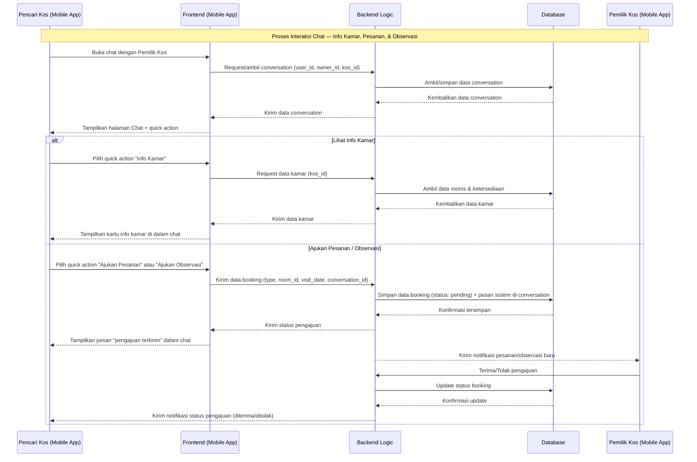
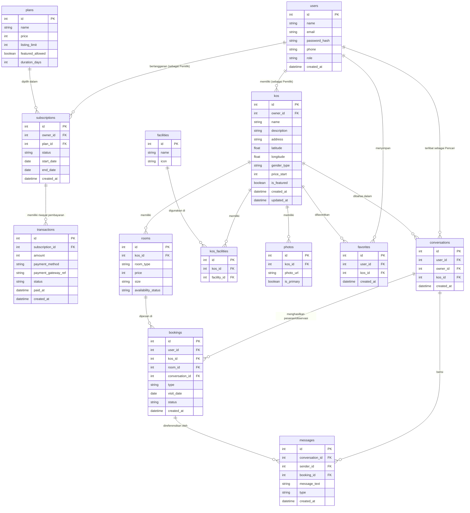

# PRD — Project Requirements Document
## Aplikasi "KosanKu" — Cari Kos (SaaS)

## 1. Overview
Mencari kos yang sesuai kebutuhan (lokasi, harga, tipe kamar, dan fasilitas) masih sering merepotkan karena informasi tersebar di berbagai grup, marketplace, atau harus survei langsung ke lokasi. Di sisi lain, **Pemilik Kos** juga kesulitan mempromosikan properti mereka ke calon penyewa secara efisien, terorganisir, dan berkelanjutan — sehingga dibutuhkan platform yang tidak hanya jadi etalase pencarian, tapi juga bisa dikelola secara mandiri dan berkelanjutan oleh Pemilik Kos.

Aplikasi ini dibangun dengan model **SaaS (Software-as-a-Service)**: **Pencari Kos** dapat mencari dan menghubungi Pemilik Kos secara gratis, sementara **Pemilik Kos** berlangganan (subscribe) ke platform untuk mengelola listing kosnya, dengan pilihan paket **Free** (gratis, dengan batasan) atau **Berbayar** (subscription berbayar dengan benefit lebih luas, seperti listing tanpa batas dan status kos unggulan/featured). Pembayaran langganan dilakukan langsung di dalam aplikasi melalui integrasi **payment gateway**. Interaksi lanjutan antara Pencari Kos dan Pemilik Kos — mulai dari tanya info kamar, mengajukan pesanan, hingga mengajukan jadwal observasi — dipusatkan lewat kanal **chat dalam aplikasi**, dengan tombol **WhatsApp** sebagai jalur kontak cepat alternatif di halaman Detail Kos.

## 2. Requirements
- **Aksesibilitas:** Aplikasi berbasis Mobile (mengikuti referensi desain: iOS/Android), dengan tampilan onboarding, pencarian, dan detail properti sebagai alur utama.
- **Pengguna:** Dua peran — **Pencari Kos** (mencari & menghubungi, gratis sepenuhnya) dan **Pemilik Kos** (mengelola listing miliknya, berstatus sebagai *tenant* berlangganan). Registrasi menentukan peran pengguna.
- **Model Bisnis (SaaS):** Freemium dengan **2 tingkatan paket** untuk Pemilik Kos:
  - **Free** — gratis, dengan batasan jumlah listing kos aktif (mis. maksimal 1 kos) dan tanpa akses fitur promosi.
  - **Berbayar** — subscription berbasis periode (bulanan), listing kos tanpa batas, dan akses fitur **Kos Unggulan (Featured)** agar tampil lebih atas di hasil pencarian.
- **Pembayaran:** Wajib terintegrasi dengan **payment gateway** pihak ketiga (mis. Midtrans/Xendit) untuk memproses pembayaran langganan Pemilik Kos, mendukung metode umum di Indonesia (transfer bank, e-wallet, QRIS, dsb). Sistem tidak menyimpan data kartu/pembayaran sensitif secara langsung — diserahkan ke payment gateway.
- **Interaksi & Transaksi via Chat:** Semua interaksi lanjutan dari Pencari Kos ke Pemilik Kos — termasuk menanyakan **info kamar** terkini (ketersediaan & harga), mengajukan **pesanan/booking** kamar, dan mengajukan jadwal **observasi/survei** lokasi — dilakukan melalui satu kanal **chat dalam aplikasi**, bukan form terpisah, agar seluruh riwayat percakapan dan pengajuan tersimpan dalam satu thread.
- **Kontak Alternatif via WhatsApp:** Selain chat dalam aplikasi, halaman Detail Kos juga menyediakan tombol **WhatsApp** yang mengarahkan langsung ke nomor WA Pemilik Kos (format tautan `wa.me`) dengan pesan otomatis, sebagai jalur komunikasi cepat di luar sistem chat aplikasi.
- **Data Input:** Pemilik Kos menginput data kos secara manual (nama, alamat, harga, foto, fasilitas, nomor telepon/WA) lewat form di aplikasi, dibatasi sesuai paket langganan aktif.
- **Spesifisitas Data:** Setiap kos wajib mencantumkan tipe (Putra/Putri/Campur), harga per bulan, titik lokasi (lat/long), daftar fasilitas, dan minimal satu foto.
- **Pencarian & Filter:** Pengguna dapat mencari berdasarkan kata kunci lokasi dan memfilter berdasarkan tipe kos, rentang harga, dan fasilitas. Kos berstatus **Featured** ditampilkan lebih dahulu dalam hasil pencarian.
- **Notifikasi:** Pemilik Kos mendapat notifikasi saat ada pesan, pesanan, atau pengajuan observasi baru lewat chat, serta pengingat saat masa langganan berbayar akan berakhir.

## 3. Core Features
Fitur-fitur kunci yang harus ada dalam versi pertama (MVP):

1. **Onboarding & Autentikasi**
   - Layar perkenalan aplikasi dengan tagline & tombol mulai (mengikuti referensi desain).
   - **Registrasi:** Menggunakan email & password, disertai pemilihan peran saat pendaftaran: **Pencari Kos** atau **Pemilik Kos**. Setelah registrasi, sistem mengirim **email verifikasi** (tautan aktivasi) sebelum akun dapat login sepenuhnya.
   - **Login:** Menggunakan email & password. Sistem menampilkan pesan error yang jelas untuk kombinasi email/password salah, dan membatasi percobaan login berulang (rate limiting) untuk mencegah brute-force.
   - **Lupa Password:** Pengguna dapat meminta reset password lewat email; sistem mengirim tautan reset (berlaku sementara/expired) untuk membuat password baru.
   - **Sesi Login:** Setelah login berhasil, sistem menerbitkan token sesi (JWT) yang disimpan di perangkat pengguna untuk mengakses fitur-fitur yang memerlukan autentikasi (chat, favorit, kelola listing, langganan). Tersedia opsi **Logout** dari halaman Profil.
   - **Lengkapi Profil:** Setelah login/registrasi, pengguna dapat melengkapi data profil seperti nama dan nomor telepon (khusus Pemilik Kos, nomor ini juga dipakai sebagai kontak WhatsApp di halaman Detail Kos miliknya).
2. **Explore & Pencarian Kos**
   - Search bar untuk mencari berdasarkan nama/lokasi kos.
   - Filter cepat: Tipe Kos (Putra/Putri/Campur), rentang harga, fasilitas.
   - Daftar rekomendasi/kos terdekat dalam bentuk card (foto, nama, harga/bulan, lokasi singkat, ikon fasilitas utama, tombol favorit, badge "Unggulan" bila berlaku).
3. **Detail Kos**
   - Galeri foto, nama kos, harga mulai dari, alamat lengkap.
   - Ringkasan spesifikasi: tipe kamar tersedia, kamar mandi (dalam/luar), ukuran kamar, jumlah kamar kosong.
   - Daftar lengkap fasilitas (WiFi, AC, kasur, lemari, dapur bersama, parkir, dsb).
   - Info Pemilik/Pengelola Kos beserta dua tombol kontak: **"Chat di Aplikasi"** dan **tombol WhatsApp** (ikon WA, membuka `wa.me` dengan pesan otomatis berisi nama kos).
   - Peta lokasi kos.
4. **Favorit**
   - Simpan kos yang diminati ke daftar favorit untuk dilihat kembali nanti.
5. **Chat & Interaksi dengan Pemilik Kos**
   - Percakapan dalam aplikasi antara Pencari Kos dan Pemilik Kos, diakses lewat **menu Chat tersendiri di bottom navigation** (bukan bubble mengambang), karena satu pengguna dapat memiliki banyak thread berbeda dengan beberapa Pemilik Kos sekaligus.
   - Halaman awal menu Chat berupa **daftar percakapan (inbox)**: list seluruh `conversations` milik pengguna, diurutkan berdasarkan pesan terakhir, menampilkan nama lawan bicara, nama kos terkait, cuplikan pesan terbaru, dan **badge jumlah pesan belum dibaca** (juga ditampilkan sebagai badge angka pada ikon Chat di bottom nav).
   - Tombol **"Chat di Aplikasi"** di halaman Detail Kos (fitur 3) berfungsi sebagai shortcut: menekan tombol ini langsung membuka/membuat `conversation` yang sesuai (`user_id`, `owner_id`, `kos_id`) dan mengarahkan pengguna langsung ke thread tersebut, tanpa perlu mencarinya dulu di daftar inbox.
   - Quick action di dalam chat: **Lihat Info Kamar** (ketersediaan & harga kamar terbaru langsung dari data kos), **Ajukan Pesanan/Booking** kamar, dan **Ajukan Jadwal Observasi/Survei** lokasi.
   - Setiap pesanan atau pengajuan observasi tercatat sebagai bagian dari thread percakapan yang sama, lengkap dengan status (menunggu/diterima/ditolak).
   - Pada sisi **Pemilik Kos**, menu Chat yang sama berfungsi sebagai inbox terpusat untuk memantau pesan masuk dari banyak calon penyewa berbeda sekaligus, termasuk pengajuan pesanan/observasi yang perlu direspons.
6. **Kelola Listing Kos (Pemilik Kos)**
   - Tambah, edit, hapus data kos beserta kamar, foto, fasilitas, dan nomor telepon/WA kontak.
   - Jumlah kos aktif yang bisa ditambahkan dibatasi sesuai paket langganan yang berlaku.
   - Lihat & kelola daftar pesanan/pengajuan observasi yang masuk lewat chat, lalu terima atau tolak langsung dari sana.
7. **Langganan & Pembayaran (Pemilik Kos)**
   - Halaman pilih/upgrade paket (Free → Berbayar), menampilkan perbandingan benefit tiap paket.
   - Checkout & pembayaran melalui payment gateway, dengan konfirmasi status otomatis (webhook).
   - Riwayat pembayaran/invoice dan status masa aktif langganan.
8. **Kos Unggulan (Featured Listing)**
   - Fitur eksklusif paket Berbayar: kos yang ditandai akan diprioritaskan tampil di hasil pencarian & halaman Explore.

## 4. User Flow
Alur utama pengguna (fokus pada peran **Pencari Kos**, dengan percabangan untuk **Pemilik Kos**):

1. **Buka Aplikasi:** Pengguna melihat layar onboarding lalu menekan tombol mulai.
2. **Login/Daftar:**
   - **Pengguna baru** → Registrasi dengan email & password, pilih peran (Pencari Kos atau Pemilik Kos) → verifikasi email (klik tautan aktivasi) → login.
   - **Pengguna lama** → Login dengan email & password. Jika lupa password, pilih "Lupa Password" → menerima tautan reset lewat email → buat password baru → login dengan password baru.
   - Jika **Pencari Kos** → langsung lanjut ke langkah 3, tanpa langganan apapun.
   - Jika **Pemilik Kos** → akun otomatis berstatus paket **Free**, lalu diarahkan ke halaman kelola kos.
     - Jika ingin **Upgrade ke Berbayar** → pilih paket → diarahkan ke halaman pembayaran (payment gateway) → setelah pembayaran dikonfirmasi, status langganan berubah menjadi Berbayar dan batasan listing terbuka.
3. **Jelajah/Cari Kos:** Pencari Kos membuka halaman Explore, mengetik kata kunci lokasi dan/atau menerapkan filter (tipe kos, harga, fasilitas).
4. **Lihat Daftar Hasil:** Sistem menampilkan daftar kos yang sesuai, dengan kos berstatus Unggulan tampil lebih dahulu.
5. **Lihat Detail Kos:** Pengguna memilih salah satu kos untuk melihat foto, harga, fasilitas, dan lokasi lengkap.
6. **Simpan ke Favorit (opsional):** Pengguna dapat menandai kos sebagai favorit untuk dibandingkan nanti.
7. **Hubungi Pemilik:** Pada halaman Detail Kos, pengguna memilih salah satu jalur kontak:
   - **Chat di Aplikasi** → membuka fitur Chat & Interaksi, lalu dari dalam chat pengguna dapat:
     - Menanyakan info kamar terbaru (ketersediaan & harga).
     - Mengajukan pesanan/booking kamar.
     - Mengajukan jadwal observasi/survei lokasi.
   - **Tombol WhatsApp** → membuka aplikasi WhatsApp langsung ke nomor Pemilik Kos dengan pesan otomatis, sebagai jalur komunikasi cepat di luar sistem chat aplikasi (tidak melalui backend/chat dalam aplikasi).
8. **Konfirmasi Pemilik:** Khusus jalur Chat di Aplikasi — Pemilik Kos menerima notifikasi atas pesanan/pengajuan observasi yang masuk lewat chat, lalu menerima atau menolak langsung dari dalam percakapan tersebut.
9. **Perpanjangan Langganan (Pemilik Kos):** Saat masa paket Berbayar mendekati habis, Pemilik Kos menerima notifikasi pengingat dan dapat memperpanjang langsung melalui menu Langganan.

## 5. Architecture
Berikut adalah gambaran arsitektur sistem untuk proses inti interaksi: menanyakan info kamar serta mengajukan pesanan/observasi melalui chat dengan Pemilik Kos. (Tombol WhatsApp di halaman Detail Kos tidak melalui alur ini — cukup tautan `wa.me` langsung ke aplikasi WhatsApp tanpa memproses data di backend sistem.)

## 6. Database Schema

Berikut adalah Entity Relationship Diagram (ERD) yang menggambarkan struktur database utama:

| Tabel | Deskripsi |
|-------|-----------|
| **users** | Data pengguna dengan dua kemungkinan peran: Pencari Kos atau Pemilik Kos. Kolom `phone` juga dipakai sebagai nomor WhatsApp pada tombol kontak langsung di halaman Detail Kos |
| **plans** | Master data paket langganan (Free & Berbayar) beserta batasan dan benefitnya |
| **subscriptions** | Status langganan aktif seorang Pemilik Kos terhadap sebuah paket |
| **transactions** | Riwayat transaksi pembayaran langganan, termasuk referensi ke payment gateway |
| **kos** | Master data kos milik seorang Pemilik Kos, mencakup lokasi, tipe, harga mulai, dan status featured |
| **rooms** | Tipe-tipe kamar yang tersedia di sebuah kos beserta harga & status ketersediaan |
| **facilities** | Master data fasilitas yang bisa dimiliki sebuah kos (WiFi, AC, dsb) |
| **kos_facilities** | Tabel relasi many-to-many antara kos dan fasilitas |
| **photos** | Galeri foto milik sebuah kos |
| **favorites** | Tabel relasi kos yang disimpan/difavoritkan oleh pengguna |
| **conversations** | Thread percakapan antara Pencari Kos dan Pemilik Kos terkait sebuah kos |
| **messages** | Pesan-pesan dalam sebuah conversation, termasuk pesan terstruktur seperti info kamar atau update status pesanan/observasi (`type`) |
| **bookings** | Pengajuan pesanan/booking kamar atau observasi/survei lokasi, diajukan lewat chat dan tertaut ke sebuah conversation (`type` membedakan booking vs survei) |

## 7. Design & Technical Constraints
1. **High-Level Technology:**
   Sistem sebaiknya dibangun dengan teknologi yang mendukung pengembangan cepat (rapid development) dan mudah dipelihara (maintainability), mengingat aplikasi memiliki dua peran pengguna serta lapisan langganan/pembayaran dalam satu basis kode. Pengembang bebas memilih tools yang sesuai selama tetap memperhatikan performa pencarian/filter (fitur inti) dan skalabilitas jumlah Pemilik Kos yang berlangganan.

2. **Pembayaran & Keamanan:**
   Seluruh proses pembayaran wajib melalui payment gateway pihak ketiga (mis. Midtrans/Xendit); sistem hanya menyimpan status & referensi transaksi, bukan data kartu/pembayaran sensitif. Status langganan wajib disinkronkan lewat mekanisme webhook dari payment gateway, bukan hanya dari sisi klien, agar tidak bisa dimanipulasi.

3. **Chat sebagai Kanal Transaksi:**
   Antarmuka chat perlu mendukung *quick action*/kartu pesan terstruktur (bukan hanya teks bebas) untuk info kamar, pesanan, dan pengajuan observasi, sehingga setiap pengajuan tetap mudah dilacak statusnya (menunggu/diterima/ditolak) dari dalam satu thread percakapan. Chat diimplementasikan sebagai **menu/tab tersendiri berisi daftar percakapan (inbox)**, bukan bubble chat mengambang — karena baik Pencari Kos maupun Pemilik Kos bisa memiliki banyak thread aktif dengan lawan bicara berbeda-beda dalam waktu bersamaan.

4. **Tombol Kontak WhatsApp:**
   Tombol WA di halaman Detail Kos menggunakan format tautan `wa.me/<nomor>` dengan pesan otomatis (pre-filled text) berisi nama kos yang sedang dilihat. Tombol ini hanya tampil/aktif jika Pemilik Kos telah mengisi nomor telepon yang valid pada data kosnya, dan berjalan murni di sisi klien (deep link), tanpa memerlukan proses tambahan di backend.

5. **Visual & UI Reference:**
   Desain UI mengikuti gaya referensi yang diupload: tampilan bersih dan minimalis dengan palet warna netral (krem/off-white, putih, dan aksen hitam/gelap), card properti dengan sudut membulat (rounded corner) dan bayangan lembut (soft shadow), serta bottom navigation bar mengambang (floating) berisi ikon Home, Peta, Favorit, Chat, dan Profil.

6. **Typography Rules:**
   Gunakan font Sans-serif modern dan geometris (mengikuti kesan pada referensi desain, mis. keluarga font seperti Inter/Poppins) untuk seluruh teks UI, dengan hierarki tebal (bold) yang jelas untuk judul harga dan nama kos.

7. **Autentikasi & Keamanan Akun:**
   Password pengguna disimpan dalam bentuk hash (mis. bcrypt/argon2), tidak pernah disimpan sebagai plain text. Sesi login menggunakan token (JWT) dengan masa berlaku (expiry) dan mekanisme refresh token. Tautan verifikasi email dan reset password wajib memiliki masa berlaku terbatas (mis. 30–60 menit) dan hanya dapat dipakai sekali. Endpoint login dilindungi rate limiting untuk mencegah percobaan brute-force.
